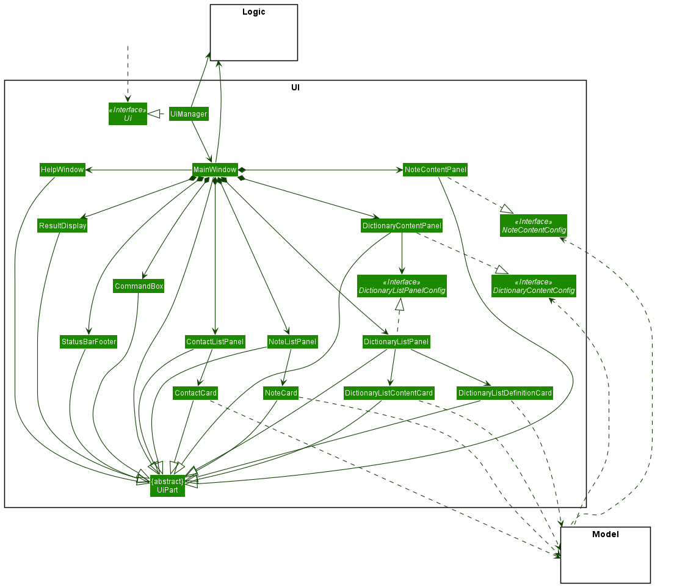
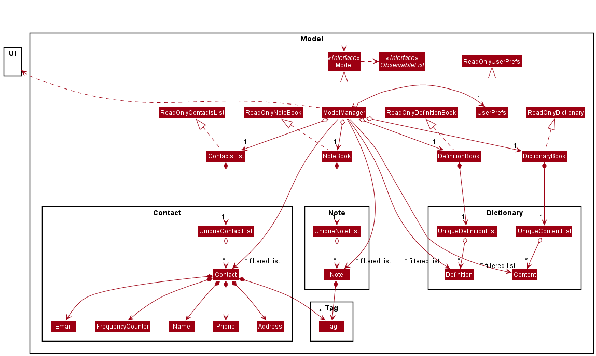
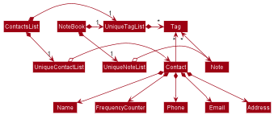
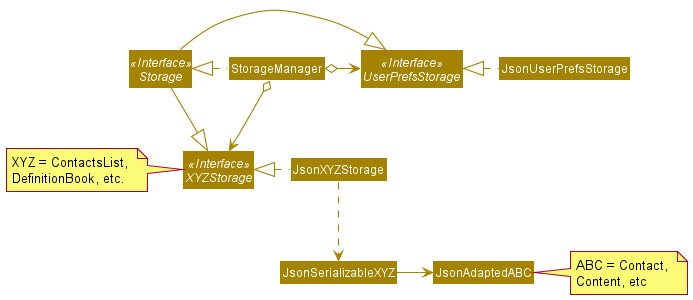
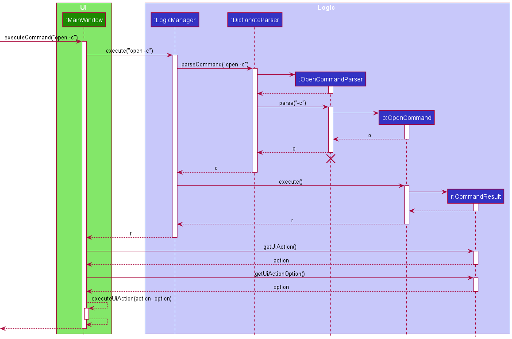

* Table of Contents
{:toc}

--------------------------------------------------------------------------------------------------------------------

## **Introduction**
### Purpose

The purpose of this document is to cover the multi-level design architecture of Dictionote, so that the
intended audience of this document can understand the relationship between components that make up Dictionote.

### Audience

This developer guide is for anyone who wants to understand the internal software architecture of Dictionote.
The following groups of people are the intended audience:
* Dictionote developers: anyone who wish to upgrade Dictionote to support more functions.
* CS2103/T students: students of CS2103/T who want to improve their efficiency and productivity in learning.

### Dictionote Overview

Dictionote is a desktop app for CS2103/T Students, optimized for use via a Command Line Interface (CLI)
while still having the benefits of a Graphical User Interface (GUI). Dictionote in general helps to organise content and
definitions from the CS2103/T textbook, provide Note-keeping functions to facilitate learning, and enhance the ability
for students to connect and learn together with their cohort mates.

--------------------------------------------------------------------------------------------------------------------

## **Setting up, getting started**

Refer to the guide [_Setting up and getting started_](SettingUp.md).

--------------------------------------------------------------------------------------------------------------------

## **Design**

### Architecture

The ***Architecture Diagram*** given above explains the high-level design of the App. Given below is a quick overview of each component.

:bulb: **Tip:** The `.puml` files used to create diagrams in this document can be found in the [diagrams](https://github.com/AY2021S2-CS2103T-W13-1/tp/tree/master/docs/diagrams/) folder. Refer to the [_PlantUML Tutorial_ at se-edu/guides](https://se-education.org/guides/tutorials/plantUml.html) to learn how to create and edit diagrams.

**`Main`** has two classes called [`Main`](https://github.com/AY2021S2-CS2103T-W13-1/tp/tree/master/src/main/java/seedu/dictionote/Main.java) and [`MainApp`](https://github.com/AY2021S2-CS2103T-W13-1/tp/tree/master/src/main/java/seedu/address/MainApp.java). It is responsible for,
* At app launch: Initializes the components in the correct sequence, and connects them up with each other.
* At shut down: Shuts down the components and invokes cleanup methods where necessary.

[**`Commons`**](#common-classes) represents a collection of classes used by multiple other components.

The rest of the App consists of four components.

* [**`UI`**](#ui-component): The UI of the App.
* [**`Logic`**](#logic-component): The command executor.
* [**`Model`**](#model-component): Holds the data of the App in memory.
* [**`Storage`**](#storage-component): Reads data from, and writes data to, the hard disk.

Each of the four components,

* defines its *API* in an `interface` with the same name as the Component.
* exposes its functionality using a concrete `{Component Name}Manager` class (which implements the corresponding API `interface` mentioned in the previous point.

For example, the `Logic` component (see the class diagram given below) defines its API in the `Logic.java` interface and exposes its functionality using the `LogicManager.java` class which implements the `Logic` interface.

**How the architecture components interact with each other**

The *Sequence Diagram* below shows how the components interact with each other for the scenario where the user issues the command `delete 1`.

The sections below give more details of each component.

### UI component

**API** :
[`Ui.java`](https://github.com/AY2021S2-CS2103T-W13-1/tp/tree/master/src/main/java/seedu/dictionote/ui/Ui.java)

The UI consists of a `MainWindow` that is made up of parts e.g.`CommandBox`, `ResultDisplay`, `DictionaryListPanel`, `DictionaryContentPanel` etc. All these, including the `MainWindow`, inherit from the abstract `UiPart` class.

The `UI` component uses JavaFx UI framework. The layout of these UI parts are defined in matching `.fxml` files that are in the `src/main/resources/view` folder. For example, the layout of the [`MainWindow`](https://github.com/AY2021S2-CS2103T-W13-1/tp/tree/master/src/main/java/seedu/address/ui/MainWindow.java) is specified in [`MainWindow.fxml`](https://github.com/AY2021S2-CS2103T-W13-1/tp/tree/master/src/main/resources/view/MainWindow.fxml)

The `UI` component,

* Executes user commands using the `Logic` component.
* Listens for changes to `Model` data so that the UI can be updated with the modified data.

### Logic component

**API** :
[`Logic.java`](https://github.com/AY2021S2-CS2103T-W13-1/tp/tree/master/src/main/java/seedu/dictionote/logic/Logic.java)

1. `Logic` uses the `AddressBookParser` class to parse the user command.
1. This results in a `Command` object which is executed by the `LogicManager`.
1. The command execution can affect the `Model` (e.g. adding a person).
1. The result of the command execution is encapsulated as a `CommandResult` object which is passed back to the `Ui`.
1. In addition, the `CommandResult` object can also instruct the `Ui` to perform certain actions, such as displaying help to the user.

Given below is the Sequence Diagram for interactions within the `Logic` component for the `execute("delete 1")` API call.

:information_source: **Note:** The lifeline for `DeleteCommandParser` should end at the destroy marker (X) but due to a limitation of PlantUML, the lifeline reaches the end of diagram.

### Model component

**API** : [`Model.java`](https://github.com/AY2021S2-CS2103T-W13-1/tp/tree/master/src/main/java/seedu/dictionote/model/Model.java)

The `Model`,

* stores a `UserPref` object that represents the user’s preferences.
* stores the address book data.
* exposes an unmodifiable `ObservableList<Person>` that can be 'observed' e.g. the UI can be bound to this list so that the UI automatically updates when the data in the list change.
* does not depend on any of the other three components.

:information_source: **Note:** An alternative (arguably, a more OOP) model is given below. It has a `Tag` list in the `AddressBook`, which `Person` references. This allows `AddressBook` to only require one `Tag` object per unique `Tag`, instead of each `Person` needing their own `Tag` object. 

### Storage component

**API** : [`Storage.java`](https://github.com/AY2021S2-CS2103T-W13-1/tp/tree/master/src/main/java/seedu/dictionote/storage/Storage.java)

The `Storage` component,
* can save `UserPref` objects in json format and read it back.
* can save the address book data in json format and read it back.

### Common classes

Classes used by multiple components are in the `seedu.dictionote.commons` package.

--------------------------------------------------------------------------------------------------------------------

## **Implementation**

This section describes some noteworthy details on how certain features are implemented.

### Contact features

#### Sending an email to a contact

##### Implementation

This feature is implemented as a command, `EmailCommand`, that extends `Command`. It is an index-dependent command, meaning that the user must provide an index number when typing the command as a reference to a specific contact on the contacts list.

The index number was selected to refer to a particular contact. This is due to its character length being shorter in most cases than any other field of information in `Contact` objects, making it both simple and sufficient.

The `execute()` method attempts to open a new window of the user's operating system (OS) default mail client. This is done by navigating to a `mailto` link with the contact's email address added to the end.

As an example, consider running Dictionote on a Windows 10 machine with Microsoft Outlook as the OS default mail client:

* Assume that the current state of the application is as follows (note the exisiting contacts on the left-side of the application's window):

![ContactEmailFeatureInitState]<!---(images/ContactEmailFeatureInitState.png)-->

* After typing in `emailcontact 2` and executing it, the result would be:

![ContactEmailFeatureExecute]<!---(images/ContactEmailFeatureExecute.png)-->

* A new window, belonging to Microsoft Outlook's `New Message` function, will pop up:

![ContactEmailFeatureOSClient]<!---(images/ContactEmailFeatureOSClient.png)-->

* Note that the email of the selected contact, Bob (referred to in the command by his index number), is automatically written in the `To...` field of the email's header information.

Note that if the user does not have a mail client software set as default in their OS, then Dictionote will try to navigate to the `mailto` link through the user's default browser (i.e., the `mailto` link will be treated as an ordinary URL link).

##### Design Considerations

* **Alternative 1 (current choice):** make use of the OS mail client to facilitate email features.
	* Pros: Easy to implement; utilizes a pre-existing and standardized system for invoking mail xyz.
	* Cons: Requires the user to have a mail client installed on their OS, which is then set to be the default mail client of the system.

* **Alternative 2:** implement basic email features directly into Dictionote.
	* Pros: Does not depened on the existence of external software in the OS.
	* Cons: Much harder to implement, as it requires the implementation of network-related functions to handle the connections to email servers.

### UI features

#### Manipulation UI through Command
#####  Implementation
Dictionote provides a dynamic user interface that allows the user to open and close any panel. 
When executing any given command, dictionote will have to be able to change the user interface. 
While all commands can open or close the UI panel. The user is also given the ability to manipulate UI through user command. 
The feature is implemented through the `CommandResult` that all `Command` in the system return.

`CommandResult` store a string `feedbackToUser`, enum `UiAction` and enum `UiActionOption`. `feedbackToUser` will 
be show on the `ResultDisplay` as the command execution feedback. 
`UiAction` indicate the action the command the want the `UI` to take. 
e.g `UiAction.OPEN`, `UiAction.CLOSE`, `UiAction.EXIT`, ... etc. `UiActionOption` is only applicable to some `UiAction`. 
It indicate the specific option available for the `UiAction`. 
e.g `UiActionOption.Dictionary` for `UiActionOpen` mean open dictionary panel.

The following is the sequence diagram for  `OPENCOMMAND`

#### Design Consideration
* **Alternative 1 (current choice):** Make use of the existing command `CommandResult` class
    * Pros: make use of the existing system and easy to implement
    * Cons: All command will have to decide on the response. (or use the default result)
* Alternative 2: Make use of the Model Component as an intermediary between Command and UI. The command will call a method available on the model to make a change to the UI.
    * Pros: Only the class that requires to change in UI will be needed to call the method
    * Cons: Increasing coupling.

<!--
### \[Proposed\] Undo/redo feature

#### Proposed Implementation

The proposed undo/redo mechanism is facilitated by `VersionedAddressBook`. It extends `AddressBook` with an undo/redo history, stored internally as an `addressBookStateList` and `currentStatePointer`. Additionally, it implements the following operations:

* `VersionedAddressBook#commit()` — Saves the current address book state in its history.
* `VersionedAddressBook#undo()` — Restores the previous address book state from its history.
* `VersionedAddressBook#redo()` — Restores a previously undone address book state from its history.

These operations are exposed in the `Model` interface as `Model#commitAddressBook()`, `Model#undoAddressBook()` and `Model#redoAddressBook()` respectively.

Given below is an example usage scenario and how the undo/redo mechanism behaves at each step.

Step 1. The user launches the application for the first time. The `VersionedAddressBook` will be initialized with the initial address book state, and the `currentStatePointer` pointing to that single address book state.

Step 2. The user executes `delete 5` command to delete the 5th person in the address book. The `delete` command calls `Model#commitAddressBook()`, causing the modified state of the address book after the `delete 5` command executes to be saved in the `addressBookStateList`, and the `currentStatePointer` is shifted to the newly inserted address book state.

Step 3. The user executes `add n/David …​` to add a new person. The `add` command also calls `Model#commitAddressBook()`, causing another modified address book state to be saved into the `addressBookStateList`.

:information_source: **Note:** If a command fails its execution, it will not call `Model#commitAddressBook()`, so the address book state will not be saved into the `addressBookStateList`.

Step 4. The user now decides that adding the person was a mistake, and decides to undo that action by executing the `undo` command. The `undo` command will call `Model#undoAddressBook()`, which will shift the `currentStatePointer` once to the left, pointing it to the previous address book state, and restores the address book to that state.

:information_source: **Note:** If the `currentStatePointer` is at index 0, pointing to the initial AddressBook state, then there are no previous AddressBook states to restore. The `undo` command uses `Model#canUndoAddressBook()` to check if this is the case. If so, it will return an error to the user rather
than attempting to perform the undo.

The following sequence diagram shows how the undo operation works:

:information_source: **Note:** The lifeline for `UndoCommand` should end at the destroy marker (X) but due to a limitation of PlantUML, the lifeline reaches the end of diagram.

The `redo` command does the opposite — it calls `Model#redoAddressBook()`, which shifts the `currentStatePointer` once to the right, pointing to the previously undone state, and restores the address book to that state.

:information_source: **Note:** If the `currentStatePointer` is at index `addressBookStateList.size() - 1`, pointing to the latest address book state, then there are no undone AddressBook states to restore. The `redo` command uses `Model#canRedoAddressBook()` to check if this is the case. If so, it will return an error to the user rather than attempting to perform the redo.

Step 5. The user then decides to execute the command `list`. Commands that do not modify the address book, such as `list`, will usually not call `Model#commitAddressBook()`, `Model#undoAddressBook()` or `Model#redoAddressBook()`. Thus, the `addressBookStateList` remains unchanged.

Step 6. The user executes `clear`, which calls `Model#commitAddressBook()`. Since the `currentStatePointer` is not pointing at the end of the `addressBookStateList`, all address book states after the `currentStatePointer` will be purged. Reason: It no longer makes sense to redo the `add n/David …​` command. This is the behavior that most modern desktop applications follow.

The following activity diagram summarizes what happens when a user executes a new command:

#### Design consideration:

##### Aspect: How undo & redo executes

* **Alternative 1 (current choice):** Saves the entire address book.
    * Pros: Easy to implement.
    * Cons: May have performance issues in terms of memory usage.

* **Alternative 2:** Individual command knows how to undo/redo by
  itself.
    * Pros: Will use less memory (e.g. for `delete`, just save the person being deleted).
    * Cons: We must ensure that the implementation of each individual command are correct.

_{more aspects and alternatives to be added}_

### \[Proposed\] Data archiving

_{Explain here how the data archiving feature will be implemented}_

-->

--------------------------------------------------------------------------------------------------------------------

## **Documentation, logging, testing, configuration, dev-ops**

* [Documentation guide](Documentation.md)
* [Testing guide](Testing.md)
* [Logging guide](Logging.md)
* [Configuration guide](Configuration.md)
* [DevOps guide](DevOps.md)

--------------------------------------------------------------------------------------------------------------------

## **Appendix: Requirements**

### Product scope

**Target user profile**:

* Tech-Savvy CS2103T Student
* want to ask questions
* need to find answers
* prefers to take notes

**Value proposition**:

* Main problem: no organized platform to facilitate extra learning outside of class.
* Sub-Problems
    * Easy and quick way for students to get answers for CS2103T questions.
    * Easy for students to take notes.
    * Easy way for students to find their classmates.

* Limitations:
    * Unable to provide students with thorough materials/all the answers.
    * Unable to play videos from lectures.

### User stories

#### User Stories : Main/UI

| Priority | As a …​                                                   | I want to …​                                          | So that I can…​                                            | Category               |
| -------- | -------------------------------------------------------------| -------------------------------------------------------- | ------------------------------------------------------------- | ---------------------- |
|***Main***| | | |
| `* *`    | CS2103 Student                                               | View note and dictionary side-by-side                    | Easily copy a note from dictionary                            | Main/UI/UX         |
| `* *`    | CS2103 Student                                               | Open and close Contact panel                             | Have more space for other content                             | Main/Non-essential |
| `* *`    | CS2103 Student                                               | Open and close Dictionary panel                          | Have more space for other content                             | Main/Non-essential |
| `* *`    | CS2103 Student                                               | Open and close Dictionary manager panel                  | Have more space for other content                             | Main/Non-essential |
| `* *`    | CS2103 Student                                               | Open and close Note panel                                | Have more space for other content                             | Main/Non-essential |
| `* *`    | CS2103 Student                                               | Open and close Note Manager panel                        | Have more space for other content                             | Main/Non-essential |
| `* *`    | CS2103 Student                                               | Save my UI configuration                                 | Save my time on re-adjust the Ui                              | Main/Non-essential |
| `* *`    | CS2103 Student                                               | Change my UI configuration                               | do no need to adjust the UI using mouse                       | Main/Non-essential |
| `* *`    | CS2103 Student                                               | Change my UI orientation                                 | use the space available more efficiently                      | Main/Non-essential |
|***Dictionary*** | -- | -- | --  | -- |
| `* * *`  | CS2103T student who find it troublesome to use the website   | Search for a definition of an SE term                    | Understand what it means                                      | Dictionary/Essential|
| `* * *`  | CS2103T student                                              | Find content I need                                      | Save time having to dig through the textbook                  | Dictionary/Essential|
| `* * *`  | CS2103T student                                              | List all the contents in the dictionary                  | View the extensive list of contents                           | Dictionary/Essential|
| `* * *`  | CS2103T student                                              | List all the definitions in the dictionary               | View the extensive list of contents                           | Dictionary/Essential|
| `*`      | CS2103T student                                              | Track my progress when reading through a summary         | Continue my preparation from where I left off                 | Dictionary/Non-essential|
| `* *`    | CS2103T student                                              | Copy specific contents in the dictionary to the notes    | Keep track of the important content on my personal note list  | Dictionary/Non-essential|
|***Note*** |  |  |  | |
| `* * *`  | CS2103T student                                              | Take a new note                                          | Have easy access to my materials whenever I need them         | Note/Essential  |
| `* * * ` | CS2103T student                                              | Delete an existing note                                  | Remove out-of-date notes.                                     | Note/Essential  |
| `* * * ` | CS2103T student                                              | Edit a note                                              | Revise a small typo in the note.                              | Note/Essential  |
| `* * * ` | CS2103T student                                              | Look at all notes                                        | Remember what is the content of the note                      | Note/Essential  |
| `* * * ` | CS2103T student                                              | Show a specific note                                     | To read the content of a specific note in detail              | Note/Essential  |
| `* * * ` | CS2103T student                                              | Edit a note in edit mode                                 | Modify the content of the note easily.                        | Note/Essential  |
| `* * `   | CS2103T student                                              | Tag a note                                               | I can access notes easily.                                    | Note/Non-Essential  |
| `* * `   | CS2103T student                                              | Track the date and time the note is created              | Find the note according to the time created                   | Note/Non-Essential  |
| `* * `   | CS2103T student                                              | Sort a note alphabetically                               | I can read the notes in order.                                | Note/Non-Essential  |
| `* * `   | CS2103T student                                              | Search a note using keyword                              | Find out what notes contain the specific keyword.             | Note/Non-Essential  |
| `* * `   | CS2103T student                                              | Mark a note as undone                                    | Remember which part of the notes I have not done yet.         | Note/Non-Essential  |
| `* * `   | CS2103T student                                              | Mark all notes as undone                                 | Reset all the features I have marked as done.                 | Note/Non-Essential  |
| `* `     | CS2103T student                                              | Track the date and time the note is last modified        | Find the note according to the time last modify.              | Note/Non-Essential  |
| `* `     | CS2103T student                                              | Mark a content of a note as done                         | Remember which part of the notes I have done.                 | Note/Non-Essential  |
|***Contact***| | | | |
| `* * *`  | CS2103T Student                                              | Add my contacts                                          | Easily manage the contacts list                               | Contact/Essential     |
| `* * *`  | CS2103T Student                                              | Edit my contacts                                         | Easily manage the contacts list                               | Contact/Essential     |
| `* * *`  | CS2103T Student                                              | Delete my contacts                                       | Easily manage the contacts list                               | Contact/Essential     |
| `* * *`  | CS2103T Student                                              | Look at all contacts                                     | Easily manage the contacts list                               | Contact/Essential     |
| `* *`    | CS2103T Student                                              | Tag a contact with a word                                | Find contacts based on their tags                             | Contact/Non-essential |
| `* *`    | CS2103T Student                                              | Search for contacts using tags                           | Contact anyone from a particular tag                          | Contact/Non-essential |
| `* *`    | CS2103T Student who wants to connect with others that I know | Email anyone from my contacts list                       | Ask questions, discuss topics, or exchange notes with them    | Contact/Non-essential |
|***Guide*** | | | | |
| `* * *`  | CS2103T student who is bad at remembering commands           | Access the list of commands with brief explanation       | Save time having to search through user guide for details     | Guide/Essential  |
| `* * *`  | CS2103T student who uses commands often                      | Scan through the list of commands for a quick refresher  | Save time having to search through user guide for all command | Guide/Essential  |

### Use cases

(For all use cases below, the **System** is the `Dictionote` and the **Actor** is the `user`, unless specified otherwise)

**Use case: UC01 - Close Panel**

**MSS**
1.  User requests to close a specific display panel
2.  Dictionote close the display Panel

    Use case ends.

**Extensions**

* 1a. The given display panel is invalid.
    * 1a1. Dictionote shows an error message

      Use case ends.

**Use case: Delete a contact**

**MSS**

1.  User requests to list contacts
2.  Dictionote shows a list of contacts
3.  User requests to delete a specific contact in the list
4.  Dictionote deletes the contact

    Use case ends.

**Extensions**

* 2a. The list is empty.

  Use case ends.

* 3a. The given index is invalid.

    * 3a1. Dictionote shows an error message.

      Use case resumes at step 2.

*{More to be added}*

### Non-Functional Requirements

#### User Requirement
1. Typing Preferred User
    * user should be targeting user who can type fast
    * user should have above average typing speed for regular English text

#### Software Requirement
1. Single User
    * should be for single user.
1. Human Editable File
    * data should be stored locally and should be in a human editable text file.
1. Single File
    * should work with a single JAR file
1. File Size
    * file sizes of the deliverables should not exceed the `100MB`

#### Dependency Requirement
1. Platform Independent
    * should work on Windows, Linux and OS-X platform.
    * avoid using OS-dependent libraries and OS-specific features
1. Java version
    * Should work on any _mainstream OS_ as long as it has Java `11` or above installed.
    * should work without requiring an installer
1. Portable
    * should work without requiring an installer
1. External Software
    * Third party frameworks/libraries is subjected to approval, and only if they,
        * are free, open-source, and have permissive license.
        * do not require any installation by the user of your software.
        * do not violate other constraint.
1. No Database Management System
    * should not use any database management system to store data.

#### Documentation Requirement
1. PDF Friendly
    * The Developer Guide and User Guide should be PDF-friendly.
    * do not use expandable panels, embedded videos, animated GIFs etc.
1. File Size
    * file sizes of documents should not exceed the `15MB`

### Glossary

* **Mainstream OS**: Windows, Linux, Unix, OS-X

--------------------------------------------------------------------------------------------------------------------

## **Appendix: Instructions for manual testing**

Given below are instructions to test the app manually.

:information_source: **Note:** These instructions only provide a starting point for testers to work on;
testers are expected to do more *exploratory* testing.

### Launch and shutdown

1. Initial launch

    1. Download the jar file and copy into an empty folder

    1. Double-click the jar file Expected: Shows the GUI with a set of sample contacts. The window size may not be optimum.

1. Saving window preferences

    1. Resize the window to an optimum size. Move the window to a different location. Close the window.

    1. Re-launch the app by double-clicking the jar file. 
       Expected: The most recent window size and location is retained.

1. _{ more test cases …​ }_

### Deleting a person

1. Deleting a person while all persons are being shown

    1. Prerequisites: List all persons using the `list` command. Multiple persons in the list.

    1. Test case: `delete 1` 
       Expected: First contact is deleted from the list. Details of the deleted contact shown in the status message. Timestamp in the status bar is updated.

    1. Test case: `delete 0` 
       Expected: No person is deleted. Error details shown in the status message. Status bar remains the same.

    1. Other incorrect delete commands to try: `delete`, `delete x`, `...` (where x is larger than the list size) 
       Expected: Similar to previous.

1. _{ more test cases …​ }_

### Saving data

1. Dealing with missing/corrupted data files

    1. _{explain how to simulate a missing/corrupted file, and the expected behavior}_

1. _{ more test cases …​ }_
